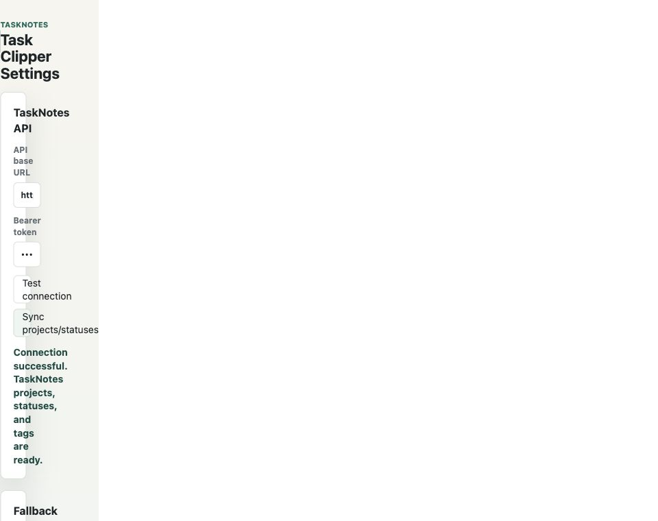
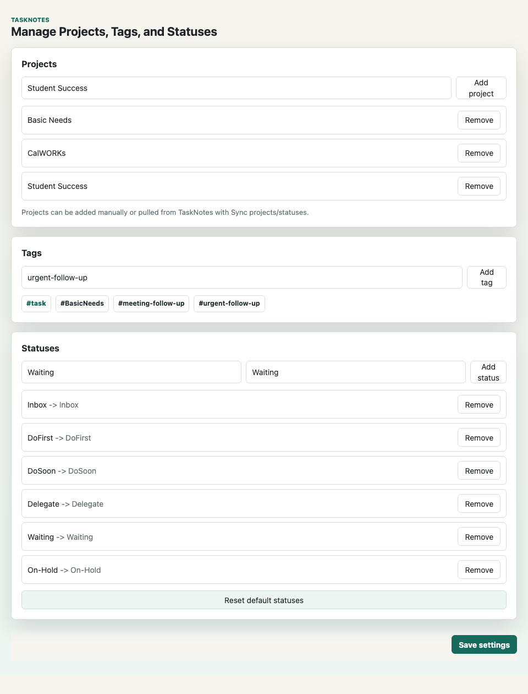
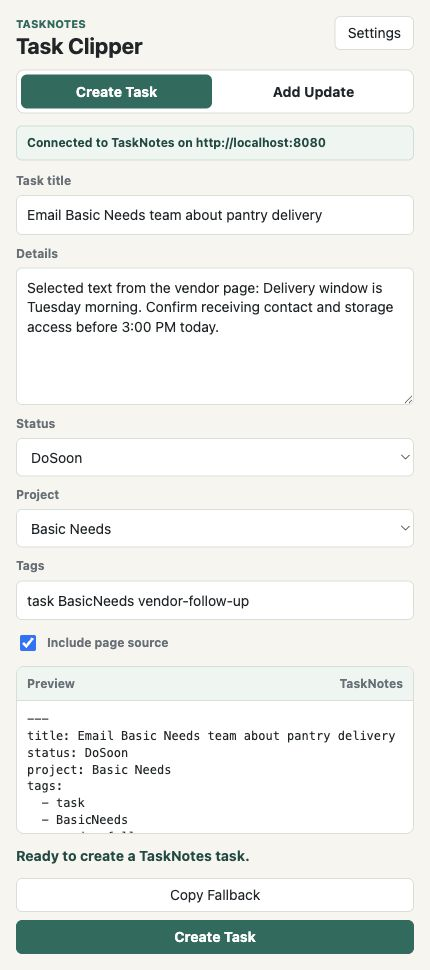
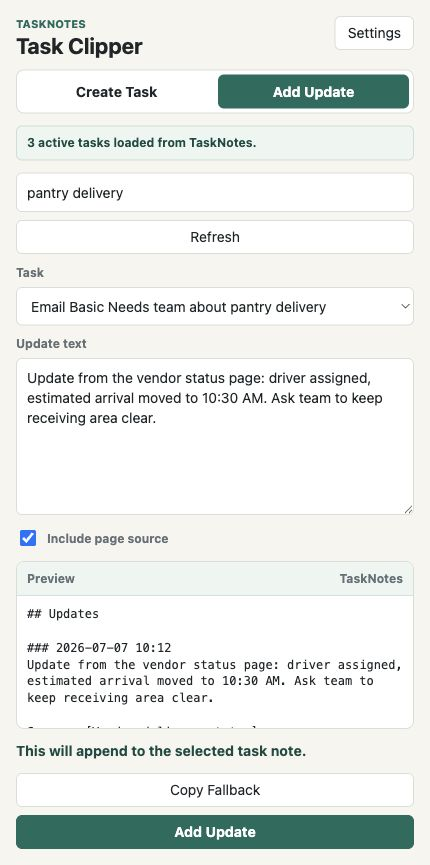

# FJG TaskNotes Clipper User Guide

This guide explains how to use the FJG TaskNotes Clipper Chrome extension with Obsidian and TaskNotes. The screenshots use sample project and task data, so your task names, projects, and statuses may differ after you sync with your vault.

The extension has two main workflows:

- **Create Task** turns selected Chrome text into a TaskNotes task note.
- **Add Update** appends selected Chrome text to the `## Updates` section of an existing TaskNotes task note.

Created tasks keep the `#task` tag so they work with TaskNotes and related task-note workflows.

## One-Time Setup

Before the clipper can create or update TaskNotes tasks, Obsidian must be running on the same Mac where you are using Chrome, and TaskNotes must have its local HTTP API enabled. With the default `http://localhost:8080` setting, `localhost` means the current Mac, not automatically the always-on Mac.

If you are clipping from the always-on Mac, run Obsidian there. If you are clipping from your main Mac, run Obsidian there and let Obsidian Sync move the new task notes to your other devices.



### A. Install the Chrome Extension

These steps happen in Chrome. Do this first if the FJG TaskNotes Clipper is not already installed.

1. Open Chrome.
2. Go to `chrome://extensions`.
3. Turn on `Developer mode`.
4. Click `Load unpacked`.
5. Select this folder:

```text
/Users/franklingarrett/Codex/plugins/obsidian-task-clipper/dist
```

6. Confirm that `FJG Obsidian Task Clipper` or `FJG TaskNotes Clipper` appears in the extensions list.
7. Pin the extension to the Chrome toolbar so it is easy to open while browsing.

If you do not have the `dist` folder yet, build it from the plugin source folder:

```bash
cd /Users/franklingarrett/Codex/plugins/obsidian-task-clipper
npm install
npm run build:chrome
```

After the extension is installed, continue with the Obsidian and TaskNotes setup below.

### B. TaskNotes Setup in Obsidian

These steps happen inside Obsidian, in the TaskNotes plugin settings.

1. In Obsidian, install and enable TaskNotes.
2. Open `Settings -> TaskNotes -> Integrations -> HTTP API`.
3. Enable the HTTP API.
4. Keep the default TaskNotes API port unless you intentionally changed it.
5. If TaskNotes asks for an API token, create or paste the token there.

TaskNotes will not show `Test connection`, `Sync projects/statuses`, or `Save settings` for this clipper. Those controls belong to the Chrome extension settings in the next section.

### C. FJG TaskNotes Clipper Setup in Chrome

These steps happen in Chrome, in the FJG TaskNotes Clipper extension options page.

1. In Chrome, right-click the FJG TaskNotes Clipper extension and open `Options`.
2. If you do not see `Options`, open `chrome://extensions`, choose `FJG TaskNotes Clipper`, then open the extension options/details page.
3. Set `API base URL` to `http://localhost:8080`, or use the port configured in TaskNotes on the Mac where Chrome is running.
4. Paste the same TaskNotes API token into `Bearer token`.
5. Click `Test connection`.
6. Click `Sync projects/statuses` to pull your TaskNotes projects, statuses, and tags into the clipper.
7. Confirm the fallback destination points to your vault and fallback task page, then click `Save settings`.

The fallback destination is only used when TaskNotes is unavailable. The normal path is to create or update TaskNotes task notes through the API.

### Using Another Laptop

You can use the extension on another laptop, but each laptop needs its own local setup. The current extension talks to TaskNotes through `http://localhost:8080`, so it connects to Obsidian on the same laptop where Chrome is running.

For each laptop you want to use:

1. Install or load the Chrome extension on that laptop.
2. Install Obsidian on that laptop.
3. Open the synced `FJG Vault` on that laptop.
4. Install and enable TaskNotes in that Obsidian vault.
5. Enable the TaskNotes HTTP API on that laptop.
6. Paste the TaskNotes API token into the FJG TaskNotes Clipper extension options on that laptop.
7. Run `Test connection` and `Sync projects/statuses`.

Chrome may sync some extension settings, but do not assume the API token or unpacked development extension will sync. Treat the token and extension install as per-device setup.

## Managing Projects, Tags, and Statuses

Use the settings page to keep the clipper aligned with your TaskNotes setup.



### Projects

Projects appear in the `Project` dropdown when you create a task. The best path is to create or maintain projects in TaskNotes, then click `Sync projects/statuses` in the clipper settings.

You can also add a project manually:

1. Open the extension settings.
2. Type the project name in `Project name`.
3. Click `Add project`.
4. Click `Save settings`.

Use the same project name that TaskNotes expects. For example, `Basic Needs` in the clipper should match `Basic Needs` in TaskNotes.

### Tags

The clipper always preserves the `task` tag. You can add more saved tags so they are easier to reuse while clipping.

To add a saved tag:

1. Open the extension settings.
2. Type the tag without the `#` symbol, such as `meeting-follow-up`.
3. Click `Add tag`.
4. Click `Save settings`.

When creating a task, you can type multiple tags in the popup separated by spaces or commas. For example:

```text
task BasicNeeds vendor-follow-up
```

The clipper removes duplicate tags and strips a leading `#` if you type one.

### Statuses

The default FJG statuses are:

- `Inbox`
- `DoFirst`
- `DoSoon`
- `Delegate`
- `Waiting`
- `On-Hold`

Each status has a display label and a TaskNotes status value. The value is what gets sent to TaskNotes. If you add a custom status, make sure the `TaskNotes status value` matches the status value configured in TaskNotes.

To add a status:

1. Open the extension settings.
2. Enter the visible label, such as `Follow Up`.
3. Enter the TaskNotes status value, such as `Follow-Up`.
4. Click `Add status`.
5. Click `Save settings`.

If the status list gets out of sync, click `Sync projects/statuses` to pull TaskNotes values again, or click `Reset default statuses` to restore the FJG defaults.

## Capture a New Task

Use `Create Task` when you find text on a web page that should become a new task note.



1. Highlight the useful text on a web page.
2. Click the FJG TaskNotes Clipper extension icon in Chrome.
3. Choose `Create Task`.
4. Edit `Task title` so it reads like an action.
5. Review or edit `Details`. This field starts with the selected web text.
6. Choose a `Status`.
7. Choose a `Project`, or leave it as `No project`.
8. Add any extra tags in `Tags`. Keep `task` in the tag list.
9. Leave `Include page source` checked if you want the task note to include the source page title and URL.
10. Review the preview.
11. Click `Create Task`.

The extension creates a TaskNotes task note with:

- the task title,
- selected text as details,
- the chosen status,
- the chosen project,
- the `task` tag plus any extra tags,
- and the source page link when `Include page source` is checked.

Practical examples:

- Turn a web page deadline into a `DoFirst` task.
- Capture vendor or partner follow-up text into a `Waiting` task.
- Save a program idea under the right project with `Inbox` status for later triage.
- Create a delegated follow-up with `Delegate` status and a project tag.

## Assign a Status

Statuses are chosen in the `Status` dropdown while creating a task. Use them to place the task into the same working state you use on your task board.

Recommended use:

- `Inbox`: captured but not triaged yet.
- `DoFirst`: high-priority or time-sensitive.
- `DoSoon`: near-term work that is not the first priority.
- `Delegate`: someone else needs to act or own the next step.
- `Waiting`: you are blocked or waiting for a response.
- `On-Hold`: intentionally paused.

The status is stored on the TaskNotes task, not just in the clipper preview. If a status does not behave correctly in TaskNotes, check the status value in settings and make sure it matches TaskNotes exactly.

## Assign a Project

Projects are chosen in the `Project` dropdown while creating a task.

Use projects when the task belongs to an ongoing body of work, such as `Basic Needs`, `CalWORKs`, `Student Success`, or another project from your vault.

If the project is missing:

1. Open extension settings.
2. Click `Sync projects/statuses`.
3. If it still does not appear, add it manually in the `Projects` section.
4. Click `Save settings`.
5. Reopen the popup.

Use `No project` for quick captures that you want to triage later.

## Add an Update to an Existing Task

Use `Add Update` when the task already exists and you want the selected web text to become a running log entry on that task note.



1. Highlight the new update text on a web page.
2. Click the FJG TaskNotes Clipper extension icon in Chrome.
3. Choose `Add Update`.
4. Click `Refresh` if the task list needs to reload.
5. Search for the existing task by title, status, or project.
6. Select the task in the `Task` dropdown.
7. Review or edit `Update text`.
8. Leave `Include page source` checked if you want the update to include a source link.
9. Review the preview.
10. Click `Add Update`.

The update is appended into the selected task note under `## Updates`. If the task note does not already have an updates section, the clipper creates one.

The update format looks like this:

```md
## Updates

### 2026-07-07 10:12
Update from the selected page text.

Source: [Page title](https://example.com/page)
```

Practical examples:

- Add a vendor delivery change to the same task instead of creating a duplicate task.
- Log a response from a partner website or shared document.
- Keep a running history of grant, project, or student-support follow-up.
- Track what changed while a task is in `Waiting` or `Delegate` status.

## Fallback Behavior

If TaskNotes is unavailable, the extension can still create a fallback Obsidian task line. This is mainly a backup path.

Fallback task lines look like this:

```md
- [ ] Email Basic Needs team about pantry delivery PJ: Basic Needs #task #DoSoon
```

The fallback path uses the settings under `Fallback Obsidian Destination`, usually:

```text
Vault name: FJG Vault
Task page: 08 Tasks/Tasks
```

Important limits:

- Fallback can create a plain Obsidian task line.
- Fallback does not add updates to existing TaskNotes task notes.
- `Add Update` requires TaskNotes API access because it edits an existing TaskNotes note.

## Troubleshooting

If the popup says TaskNotes is unavailable, confirm Obsidian is open, TaskNotes is enabled, the HTTP API is enabled, the API URL is correct, and the bearer token matches the TaskNotes token.

If projects or statuses are missing, open settings and click `Sync projects/statuses`. Reopen the popup after saving.

If an existing task does not appear in `Add Update`, make sure the task is active, not completed, and not archived. The popup only loads active tasks.

If a status clips but does not show correctly in TaskNotes, check that the status value in the clipper matches the TaskNotes status value exactly.

If no text was selected before opening the popup, you can still type the task title, details, or update text manually.
